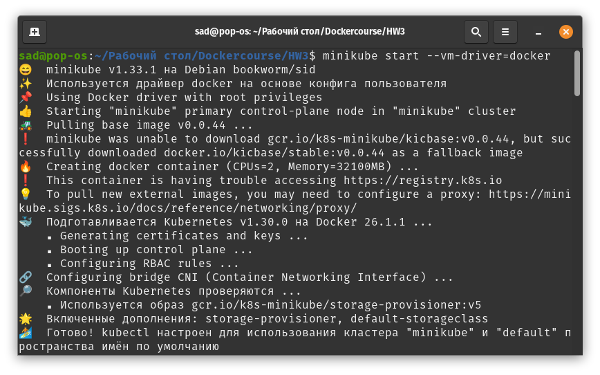
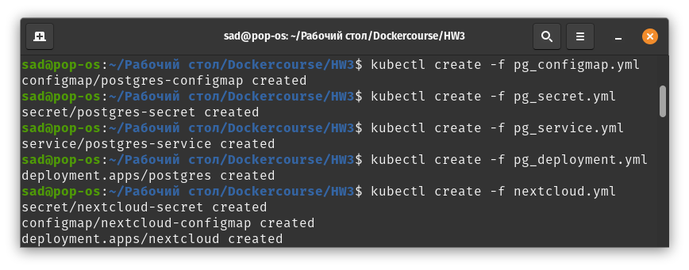
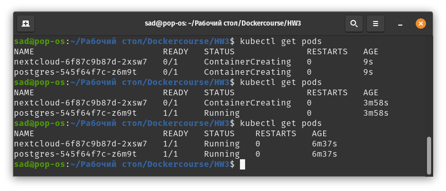

# Lab Work No. 3 - Nextcloud & PostgreSQL

## Description

This project involves deploying the Nextcloud cloud storage service using a PostgreSQL database

## Project Deploy

To deploy the project, execute the following commands:

```bash
kubectl create -f pg_configmap.yml
kubectl create -f pg_secret.yml
kubectl create -f pg_service.yml
kubectl create -f pg_deployment.yml
kubectl create -f nextcloud.yml
```

## Workflow

The following steps were taken during the workflow:

1. Starting Minikube to create a local Kubernetes cluster.
2. Using kubectl to manage Kubernetes resources.
3. Checking the status of the pods and their proper functioning.

## Visualization of Work

- Minikube start:


- Kubectl deploy:


- Pods status:


## Questions and Answers

1. **Is the order of manifest execution important?**

   Yes, the order is important. Configurations and secrets should be created first to avoid errors when deploying the deployment due to their absence.

2. **What will happen if you scale the replicas of postgres-deployment to 0 and then back to 1?**

   Scaling the replicas of a postgres-deployment in Kubernetes to 0 will terminate all the pods running for that deployment. This effectively shuts down the PostgreSQL database service, making it inaccessible to any applications or services that depend on it. Nextcloud will lose access to the PostgreSQL database, causing error 500.

   When you scale the replicas back to 1, Kubernetes will initiate a new pod for the postgres-deployment. This new pod will go through the usual initialization process, which includes starting up the PostgreSQL service and restoring its connection to persistent storage if it’s configured. This means that the database service will become accessible again once the pod is fully operational. But since the data is lost, NextCloud authorization will be broken.
