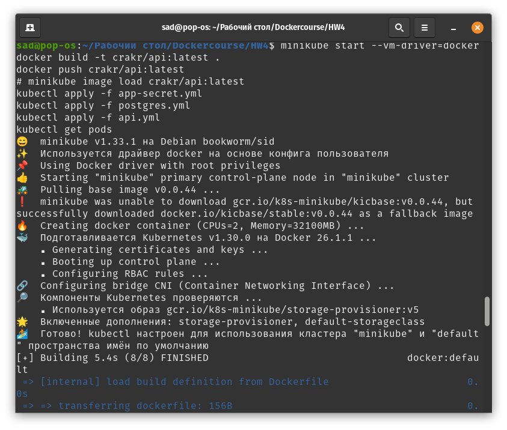
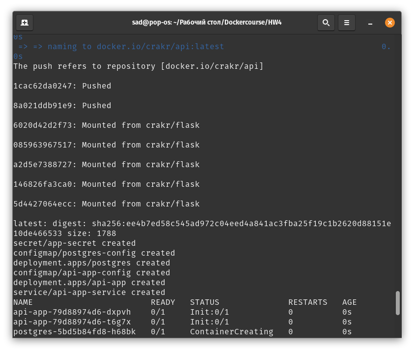
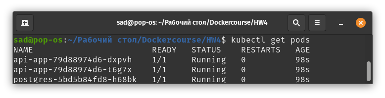
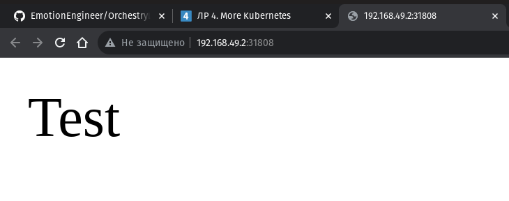

# Lab Work No. 4 - Flask API Service Deployment in Kubernetes

## Overview

This repository contains the necessary Kubernetes manifests to deploy a Flask API service alongside a PostgreSQL database. The Flask application serves a simple endpoint that returns a "Test" message. The PostgreSQL database is configured to store data for the API service.

## Architecture

The deployment consists of the following components:

- **Flask API Service**: A Python-based web service that responds to HTTP requests.
- **PostgreSQL Database**: A relational database system used to persist data for the API service.
- **Init Container**: Used to perform initial setup tasks before the main containers start.
- **Volumes**: Utilized to store persistent data for the PostgreSQL database.
- **ConfigMap and Secret**: Configuration and sensitive data management for the services.
- **Service**: A Kubernetes Service that exposes the Flask API service to external traffic.

## Prerequisites

- Docker
- Minikube
- kubectl

## Deployment Instructions

1. Start Minikube with Docker as the VM driver (for example):
   ```sh
   minikube start --vm-driver=docker
   ```

2. Build the Docker image for the Flask API service:
   ```sh
   docker build -t crakr/api:latest .
   ```

3. (Optional) Push the Docker image to a container registry:
   ```sh
   docker push crakr/api:latest
   ```

4. Load the Docker image into Minikube:
   ```sh
   minikube image load crakr/api:latest
   ```

5. Apply the Kubernetes manifests to create the secret, deployments, and service:
   ```sh
   kubectl apply -f app-secret.yml
   kubectl apply -f postgres.yml
   kubectl apply -f api.yml
   ```

6. Check the status of the deployed pods:
   ```sh
   kubectl get pods
   ```

## Screenshots






## Accessing the Service

Once the service is deployed, it can be accessed through the LoadBalancer IP provided by Minikube
```sh
minikube service api-app-service --url
```

